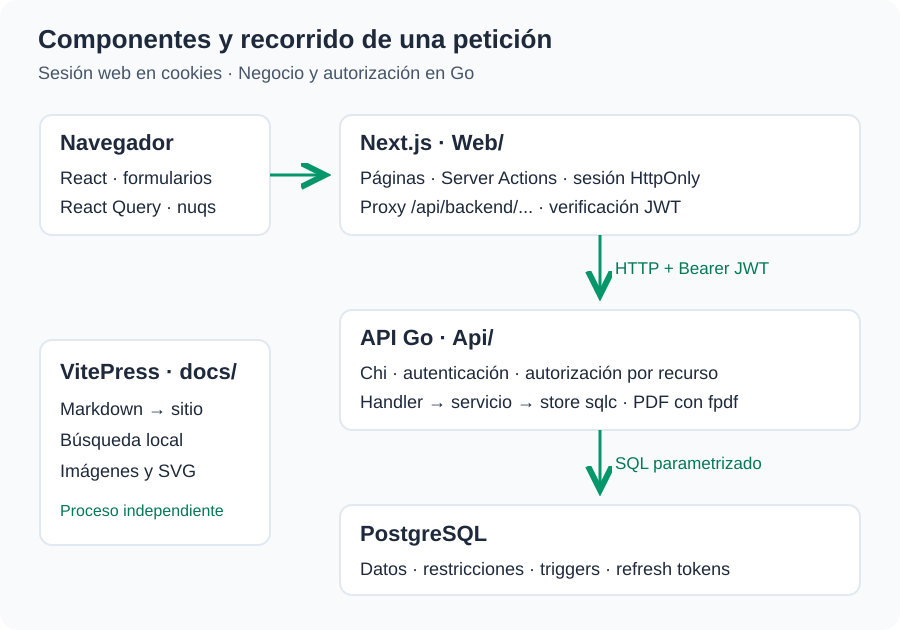

# Arquitectura del sistema

SoccerLeague tiene tres aplicaciones independientes en el mismo repositorio: interfaz Next.js, API Go y documentación VitePress. PostgreSQL almacena los datos de la liga y los tokens de renovación.

## Componentes

| Componente | Directorio | Responsabilidad | Puerto local |
| --- | --- | --- | --- |
| Frontend y servidor web | `Web/` | Páginas, formularios, sesión en cookies y proxy | 3000 |
| Backend | `Api/` | Autenticación, autorización, negocio, consultas y PDF | 8080 |
| PostgreSQL | Servicio externo | Relaciones, restricciones, triggers y migraciones | Habitualmente 5432 |
| Sitio documental | `docs/` | Markdown, navegación, imágenes y búsqueda local | 5173 |

## Flujo de una consulta

1. Un contenedor React ejecuta una consulta de React Query.
2. El servicio de módulo llama a `apiRequest` con una ruta funcional.
3. El navegador accede a `/api/backend/...` en el mismo origen de Next.js.
4. El Route Handler obtiene los tokens de cookies y añade `Authorization: Bearer ...`.
5. Chi autentica, recupera el usuario actual y verifica el permiso del recurso.
6. El handler Go interpreta la petición; el servicio ejecuta el caso de uso.
7. El store generado por sqlc ejecuta SQL sobre PostgreSQL.
8. La respuesta vuelve al contenedor, que presenta datos, vacío o error.

Una respuesta 401 puede activar renovación y un único reintento desde el proxy. Los tokens no se entregan al código del navegador mediante el contexto de autenticación.

## Límites y dependencias

El navegador depende de Next.js; Next.js depende de la URL de Go y de la misma clave JWT para verificar acceso. Go depende de PostgreSQL y de los archivos de migración. VitePress no necesita esos servicios para funcionar.

La API es un único proceso, con inyección manual de dependencias y SQL explícito. No hay microservicios, cola de trabajos, ORM ni bus de eventos.

## Decisiones de implementación

- Frontend organizado por funcionalidad, con elementos comunes en `shared/`.
- Sesión gestionada en el servidor web mediante cookies HttpOnly.
- Permisos aplicados en interfaz, páginas y API; la decisión de Go protege los datos.
- Consultas SQL y tipos Go generados por sqlc.
- Resultados y reportes calculados al consultar, sin marcador persistido en Match.
- Filtrado y paginación de listados principales en memoria dentro del servicio Go.
- PDF generado mediante una capa de renderizado propia sobre `go-pdf/fpdf`.

Consulte [frontend](./frontend.md), [backend](./backend.md), [seguridad](./seguridad.md) y [modelo](../datos/modelo.md).
