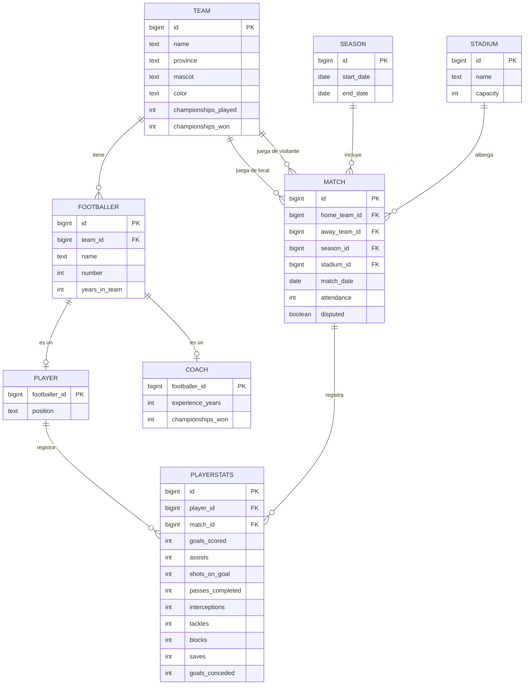

# Diagrama de base de datos - Soccer League

Diagrama entidad-relación generado a partir de [schema.sql](./schema.sql). Pega el bloque
en [mermaid.live](https://mermaid.live) para exportarlo como imagen (PNG/SVG) y exponerlo,
o ábrelo directamente en GitHub/VS Code (con la extensión Mermaid), que lo renderizan en el README.

## Notas del modelo

- `Footballer` es la tabla base compartida; `Player` y `Coach` son especializaciones 1-a-1
  (su clave primaria es también FK a `Footballer`), por eso una persona es jugador **o**
  entrenador según en qué subtabla tenga fila.
- `Match` tiene dos relaciones independientes con `Team` (local y visitante).
- Los goles del partido ya no se guardan en `Match`; se calculan a partir de la suma de
  `goals_scored` en `PlayerStats` (ver migración `000005_match_disputed_and_goals_from_stats`).
- Triggers en BD impiden registrar `PlayerStats` de partidos no disputados, cambiar un
  partido disputado a no disputado si ya tiene estadísticas, y borrar partidos con
  estadísticas asociadas.
