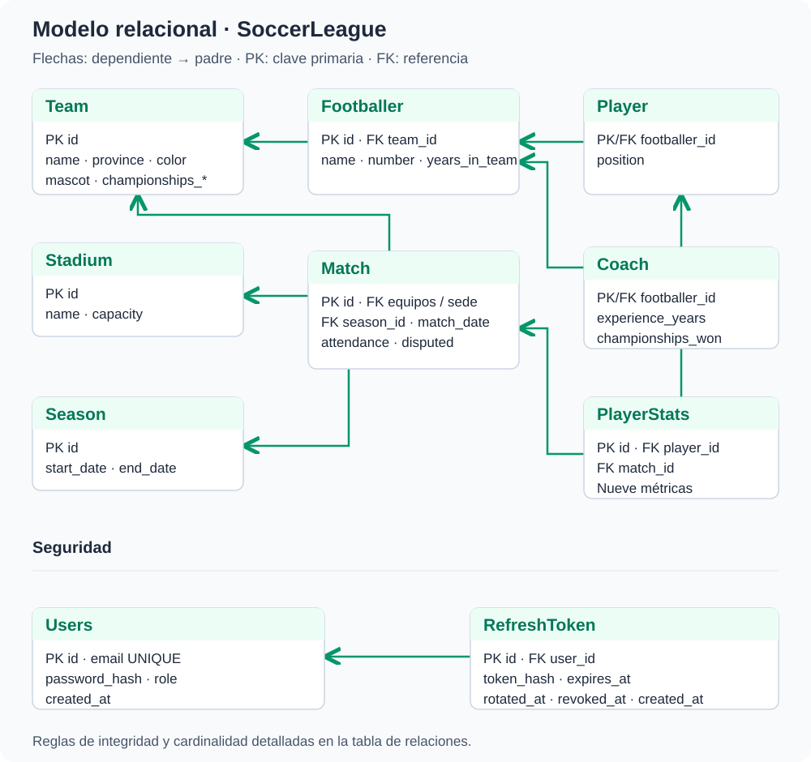

# Diagrama de relaciones

El modelo vigente contiene diez tablas: ocho deportivas y dos de seguridad. Las flechas del gráfico indican referencias desde la entidad dependiente hacia la entidad referenciada; la especialización Player/Coach comparte PK con Footballer.

## Relaciones y cardinalidad

| Referencia | Relación | Al eliminar el padre |
| --- | --- | --- |
| Footballer.team_id → Team.id | Un equipo puede tener muchos futbolistas; FK nullable | SET NULL en DB; el servicio bloquea la baja en uso |
| Player.footballer_id → Footballer.id | Cero o una fila Player por Footballer | CASCADE |
| Coach.footballer_id → Footballer.id | Cero o una fila Coach por Footballer | CASCADE |
| Match.home_team_id → Team.id | Muchos encuentros como local por equipo | RESTRICT |
| Match.away_team_id → Team.id | Muchos encuentros como visitante por equipo | RESTRICT |
| Match.season_id → Season.id | Muchos encuentros por temporada | RESTRICT; trigger exige temporada válida |
| Match.stadium_id → Stadium.id | Muchos encuentros por estadio | RESTRICT |
| PlayerStats.player_id → Player.footballer_id | Muchas participaciones por jugador | CASCADE |
| PlayerStats.match_id → Match.id | Muchas participaciones por partido | CASCADE definido; trigger bloquea borrar partido con estadísticas |
| RefreshToken.user_id → Users.id | Muchos tokens de renovación por cuenta | CASCADE |

La combinación jugador/partido es única; equipo/dorsal también es única. No existe una tabla de afiliación histórica ni una relación directa de equipo inscrito en temporada.

Player y Coach no tienen una exclusión mutua impuesta por SQL. Las FK nullable y las reglas de aplicación se distinguen en el [diccionario](./datos/modelo.md).

## Fuentes y mantenimiento

El diccionario se obtiene de `Api/sql/schema.sql`, contrastado con `Api/sql/migrations/`. Los triggers y el CHECK de equipos distintos se mantienen en migraciones, por lo que el esquema de generación no basta para recrear toda la integridad.

El gráfico es un SVG estático almacenado en `docs/assets/modelo-datos.svg`; se renderiza en el sitio sin extensiones Mermaid ni servicios externos. Al cambiar una relación se actualizan gráfico, tabla y [modelo](./datos/modelo.md).
