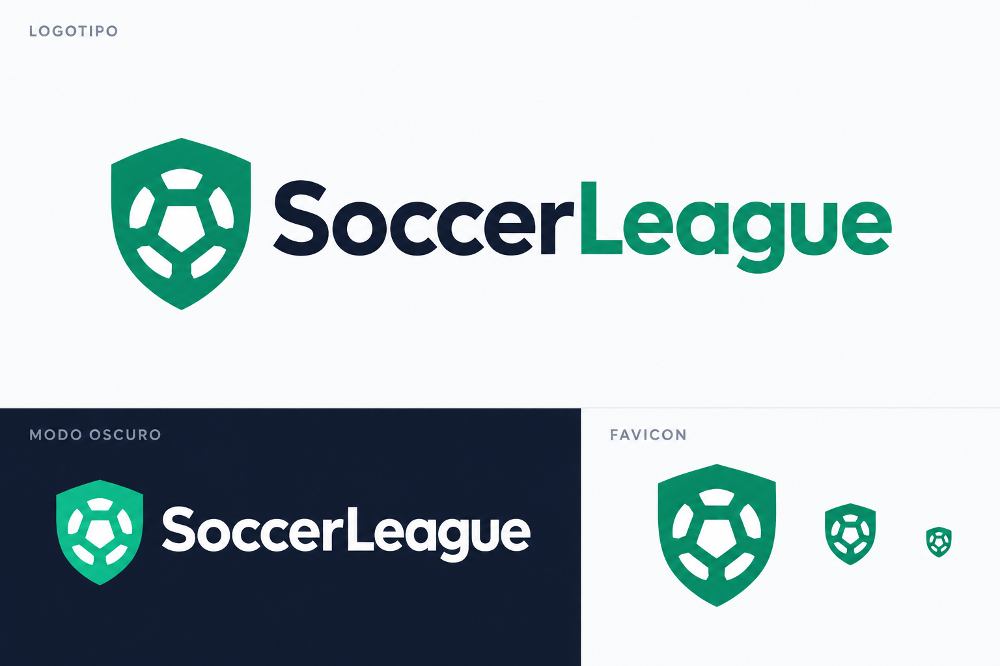
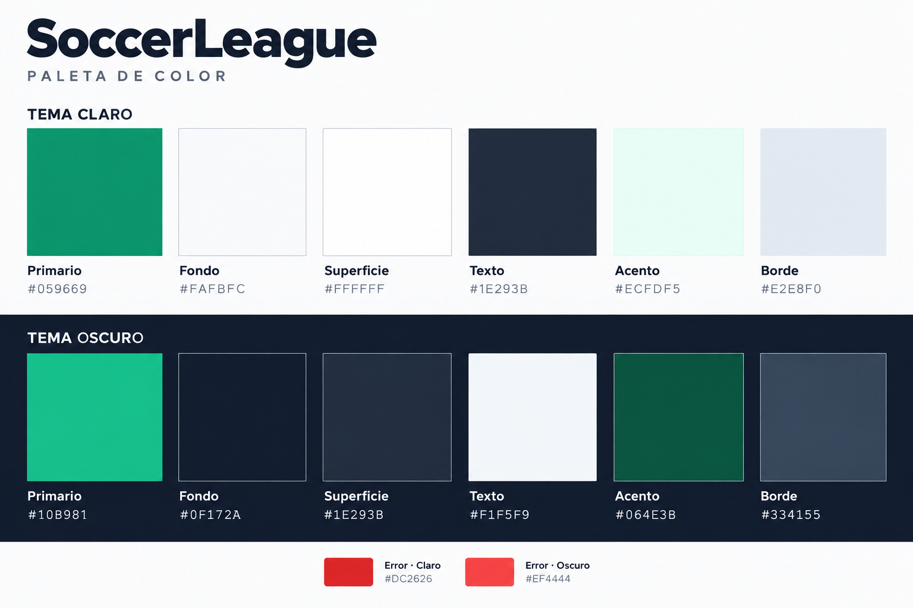
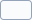
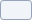
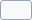
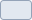

# Identidad visual de SoccerLeague

La identidad visual de SoccerLeague combina un símbolo deportivo de formas simples, una marca tipográfica y una paleta de verdes esmeralda y tonos pizarra. El sistema contempla temas claro y oscuro para las superficies, los textos y los elementos interactivos de la aplicación.

## Logotipo

### Símbolo

El símbolo integra un escudo verde esmeralda y un balón blanco construido con segmentos geométricos. Se utiliza de forma independiente en el favicon y en la barra lateral contraída.

### Marca tipográfica

El nombre se escribe **SoccerLeague**, sin espacios y con las iniciales «S» y «L» en mayúscula. En el tema claro, «Soccer» utiliza el color de texto principal y «League» el verde de marca. En el tema oscuro, el nombre completo se presenta en blanco.

### Variantes

| Variante | Composición | Aplicación |
| --- | --- | --- |
| Principal | Símbolo y nombre en disposición horizontal | Barra lateral expandida |
| Centrada | Símbolo sobre el nombre | Inicio de sesión |
| Símbolo | Escudo con balón, sin nombre | Favicon y barra lateral contraída |

## Paleta cromática

El verde esmeralda identifica la marca y las acciones principales: `#059669` en el tema claro y `#10B981` en el tema oscuro. Los tonos pizarra estructuran fondos, superficies, textos y bordes. El rojo identifica errores y acciones destructivas.

Las muestras de las tablas representan los valores hexadecimales exactos del sistema. Los tokens se definen en globals.css (`Web/src/app/globals.css`): `@theme` contiene el tema claro y `.dark` contiene sus variantes para el tema oscuro.

### Interfaz general

| Token | Uso | Tema claro | Tema oscuro |
| --- | --- | --- | --- |
| `--color-background` | Fondo de la aplicación |  `#FAFBFC` |  `#0F172A` |
| `--color-foreground` | Texto principal |  `#1E293B` |  `#F1F5F9` |
| `--color-card` | Superficie de tarjetas |  `#FFFFFF` |  `#1E293B` |
| `--color-card-foreground` | Texto sobre tarjetas |  `#1E293B` |  `#F1F5F9` |
| `--color-popover` | Superficie de menús y ventanas emergentes |  `#FFFFFF` |  `#1E293B` |
| `--color-popover-foreground` | Texto de menús y ventanas emergentes |  `#1E293B` |  `#F1F5F9` |
| `--color-primary` | Marca, acciones principales y selección |  `#059669` |  `#10B981` |
| `--color-primary-foreground` | Texto sobre acciones principales |  `#FFFFFF` |  `#0F172A` |
| `--color-secondary` | Superficies y acciones secundarias |  `#F1F5F9` |  `#334155` |
| `--color-secondary-foreground` | Texto sobre superficies secundarias |  `#475569` |  `#F1F5F9` |
| `--color-muted` | Superficies de menor énfasis |  `#F8FAFC` |  `#1E293B` |
| `--color-muted-foreground` | Texto auxiliar |  `#64748B` |  `#94A3B8` |
| `--color-accent` | Superficies de énfasis |  `#ECFDF5` |  `#064E3B` |
| `--color-accent-foreground` | Texto sobre superficies de énfasis |  `#047857` |  `#6EE7B7` |
| `--color-destructive` | Errores y acciones destructivas |  `#DC2626` |  `#EF4444` |
| `--color-destructive-foreground` | Texto sobre acciones destructivas |  `#FFFFFF` |  `#FFFFFF` |
| `--color-border` | Bordes y separadores |  `#E2E8F0` |  `#334155` |
| `--color-input` | Bordes de campos |  `#E2E8F0` |  `#334155` |
| `--color-ring` | Indicador de foco |  `#059669` |  `#10B981` |

### Barra lateral

| Token | Uso | Tema claro | Tema oscuro |
| --- | --- | --- | --- |
| `--color-sidebar` | Fondo de la barra lateral |  `#FFFFFF` |  `#111C33` |
| `--color-sidebar-foreground` | Texto de la barra lateral |  `#475569` |  `#CBD5E1` |
| `--color-sidebar-primary` | Acciones principales de la barra lateral |  `#059669` |  `#10B981` |
| `--color-sidebar-primary-foreground` | Texto sobre acciones principales |  `#FFFFFF` |  `#0F172A` |
| `--color-sidebar-accent` | Énfasis de navegación |  `#ECFDF5` |  `#064E3B` |
| `--color-sidebar-accent-foreground` | Texto de navegación enfatizada |  `#047857` |  `#6EE7B7` |
| `--color-sidebar-border` | Bordes de la barra lateral |  `#E2E8F0` |  `#1E293B` |
| `--color-sidebar-ring` | Indicador de foco de navegación |  `#059669` |  `#10B981` |

## Aplicación del sistema

- Mantener la proporción del símbolo y la relación visual entre el escudo y el balón.
- Conservar el balón blanco en ambos temas y utilizar el verde correspondiente al tema activo.
- Mantener la escritura y la distribución cromática de la marca tipográfica.
- Utilizar el símbolo independiente cuando el espacio disponible no permita mostrar el nombre completo.
- Evitar deformaciones, sombras, degradados y ornamentos añadidos al logotipo.
- Mantener sincronizados los colores de la interfaz, el favicon y las tablas de esta guía.

## Recursos

| Recurso | Ubicación | Función |
| --- | --- | --- |
| Lámina de identidad | [soccerleague-identidad.png](assets/soccerleague-identidad.png) | Referencia visual del logotipo y sus variantes |
| Lámina cromática | [soccerleague-paleta.png](assets/soccerleague-paleta.png) | Presentación visual de los colores principales |
| Muestras cromáticas | `assets/colors/` | Muestras SVG con valores hexadecimales exactos |
| Componentes de marca | SoccerLeagueLogo.tsx (`Web/src/shared/components/SoccerLeagueLogo.tsx`) | Símbolo SVG y nombre tipográfico reutilizables |
| Favicon | favicon.svg (`Web/public/favicon.svg`) | Símbolo de la aplicación en el navegador |
| Tokens de color | globals.css (`Web/src/app/globals.css`) | Definición de la paleta por tema |

El símbolo de la interfaz toma su color del token `primary`. El favicon adapta el verde mediante `prefers-color-scheme`, según la preferencia de tema del navegador o del sistema operativo. Su referencia se configura en los metadatos de la aplicación (`Web/src/app/layout.tsx`).
